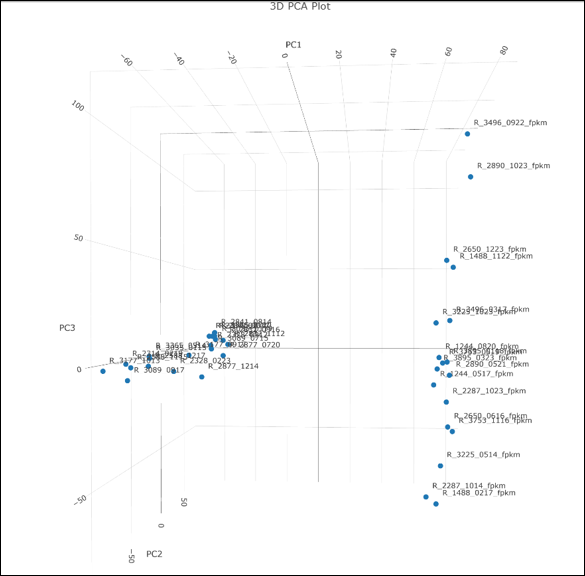
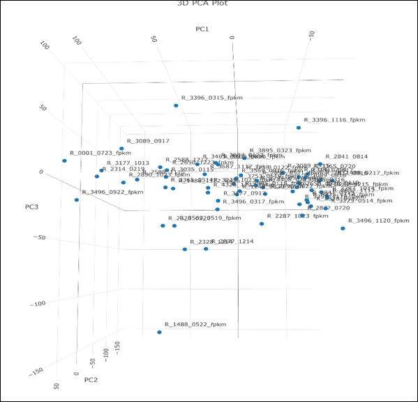

# ComBat-Seq
Combat-Seq is a method for correcting batch effects in RNA sequencing (RNA-seq) count data. When RNA samples are processed across different sequencing runs or batches, technical variations can obscure true biological signals. Combat-Seq addresses this issue by adjusting for these unwanted batch effects while preserving biological variability.

Use this tool when you have RNA-seq count matrices from multiple batches or sequencing runs, and you want to harmonize them for downstream analysis such as differential expression or clustering.

```
### 📊 PCA Comparison: Before and After Combat-Seq

| Uncorrected Data | After Combat-Seq |
|------------------|------------------|
|  |  |
```


